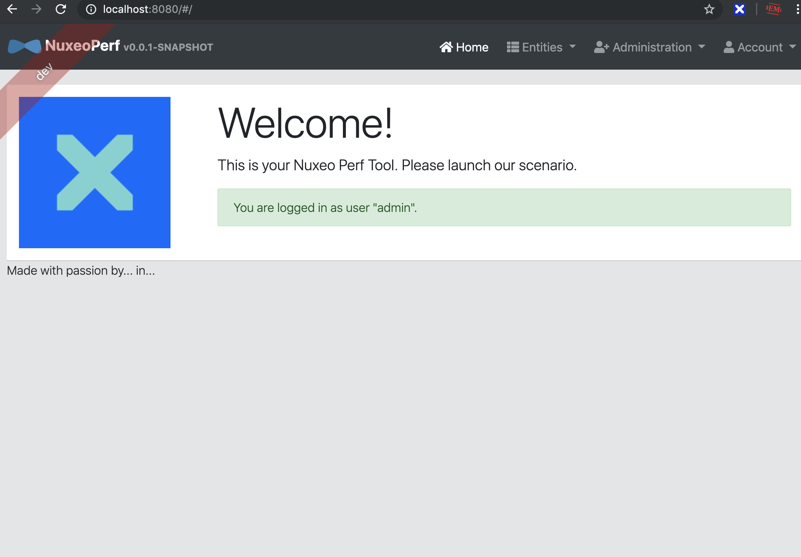
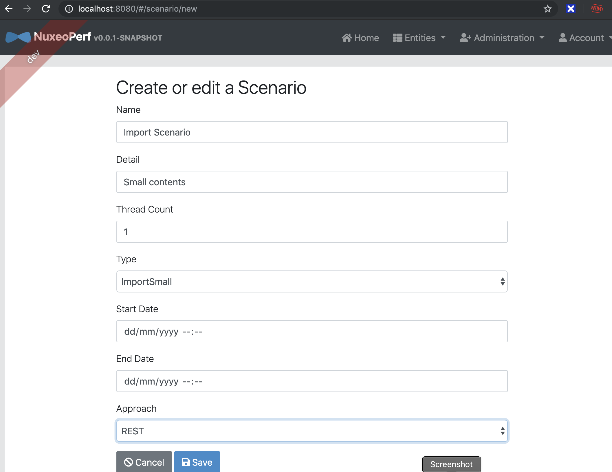
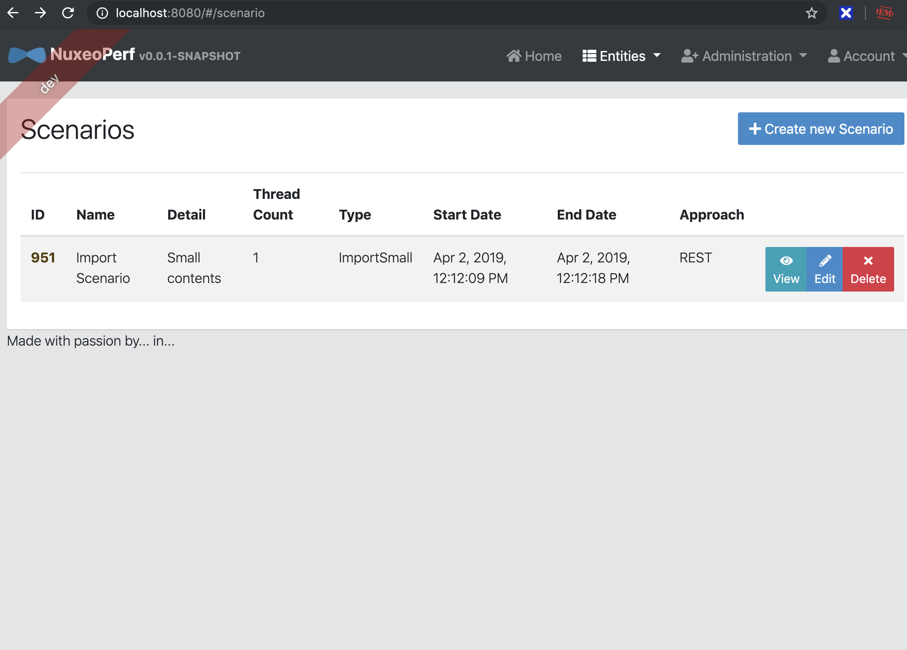

# Nuxeo Perf App

> Tools to launch Performance Scenarios on your Nuxeo Instance (import, read etc...)





## Launch

Define your env variables :

```bash
NUXEO_URL=http://...
NUXEO_LOGIN=Administrator
NUXEO_PASSWORD=xxxx
```

### Using Docker

You can fully dockerize your application and all the services that it depends on.
To achieve this, first build a docker image of your app by running:

```bash
./gradlew bootWar -Pprod jibDockerBuild
```

Then run your Nuxeo:

```bash
docker-compose up nuxeoperf-nuxeo
```

Then navigate to [http://localhost:8080](http://localhost:8080) in your browser.

## Testing

To launch your application's tests, run:

    ./gradlew test

Client tests:

    npm test

For more information, refer to the [Running tests page][].

### Code quality

Sonar is used to analyse code quality. You can start a local Sonar server (accessible on http://localhost:9001) with:

```
docker-compose -f src/main/docker/sonar.yml up -d
```

Then, run a Sonar analysis:

```
./gradlew -Pprod clean test sonarqube
```

For more information, refer to the [Code quality page][].

## Support

@mat_cloud

Please pull request !

[jhipster homepage and latest documentation]: https://www.jhipster.tech
[jhipster 5.8.1 archive]: https://www.jhipster.tech/documentation-archive/v5.8.1
[using jhipster in development]: https://www.jhipster.tech/documentation-archive/v5.8.1/development/
[using docker and docker-compose]: https://www.jhipster.tech/documentation-archive/v5.8.1/docker-compose
[using jhipster in production]: https://www.jhipster.tech/documentation-archive/v5.8.1/production/
[running tests page]: https://www.jhipster.tech/documentation-archive/v5.8.1/running-tests/
[code quality page]: https://www.jhipster.tech/documentation-archive/v5.8.1/code-quality/
[setting up continuous integration]: https://www.jhipster.tech/documentation-archive/v5.8.1/setting-up-ci/
[node.js]: https://nodejs.org/
[yarn]: https://yarnpkg.org/
[webpack]: https://webpack.github.io/
[angular cli]: https://cli.angular.io/
[browsersync]: http://www.browsersync.io/
[jest]: https://facebook.github.io/jest/
[jasmine]: http://jasmine.github.io/2.0/introduction.html
[protractor]: https://angular.github.io/protractor/
[leaflet]: http://leafletjs.com/
[definitelytyped]: http://definitelytyped.org/
